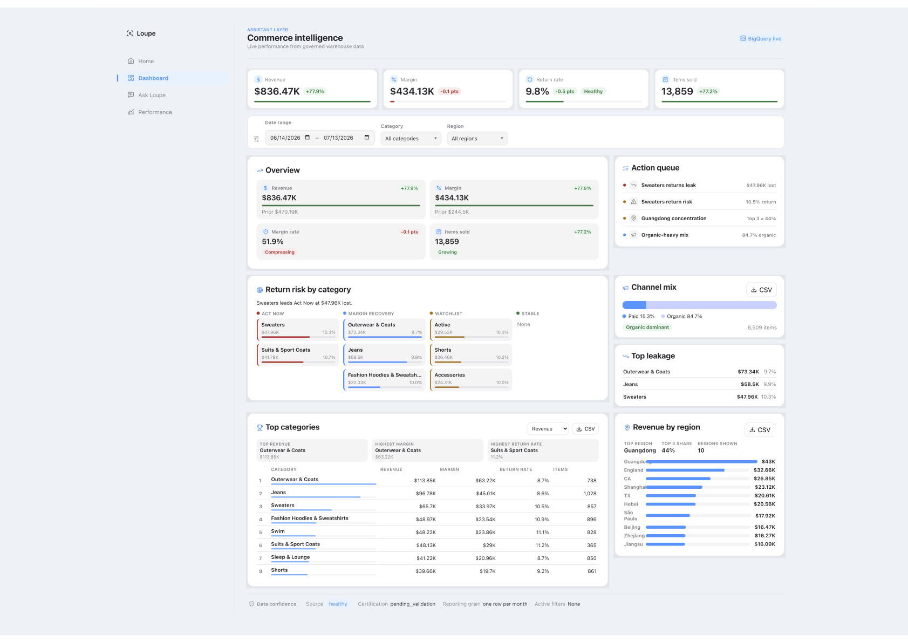
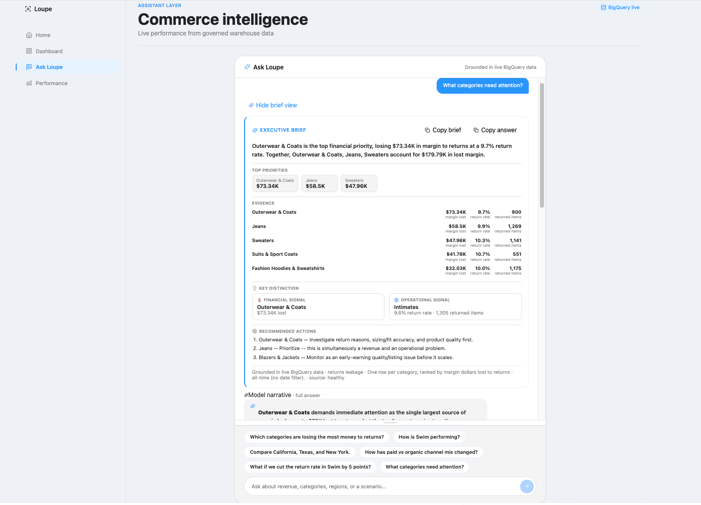
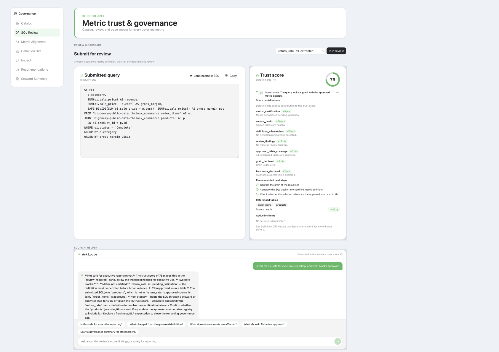
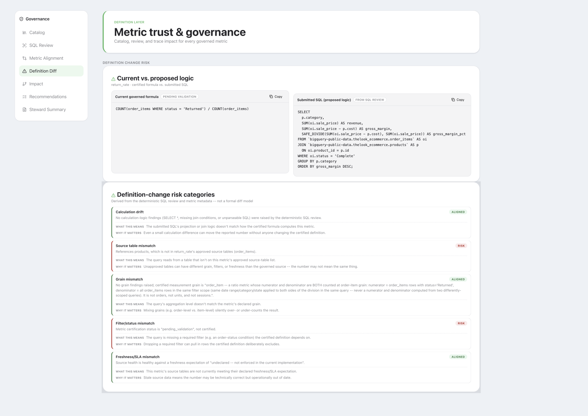
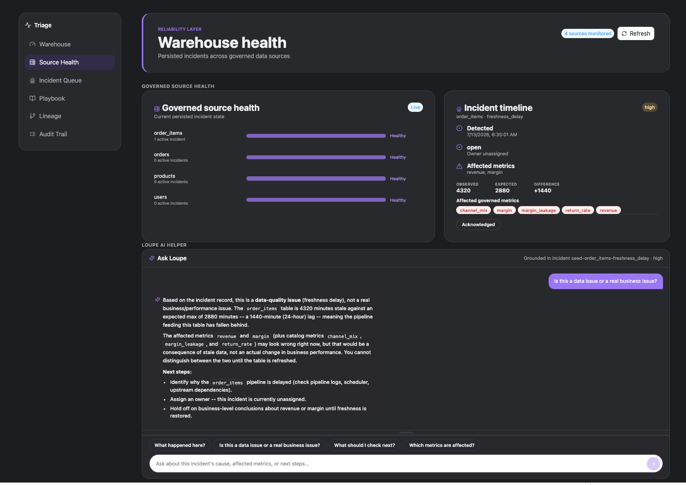
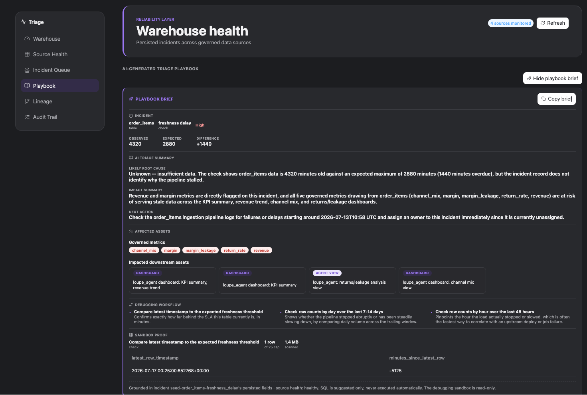
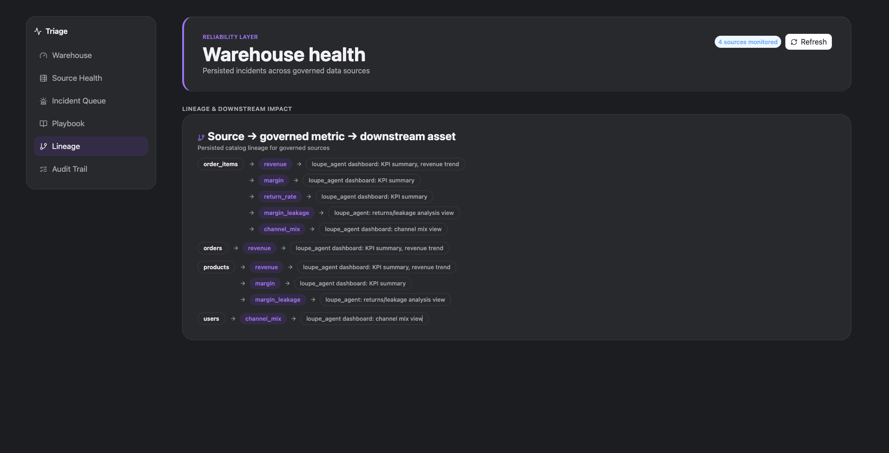

# Loupe AI Analytics Platform

AI analytics platform with three production-style apps across business performance, metric governance, and data reliability.

**Live apps**
- [Loupe Commerce Intelligence](https://loupe-web-eight.vercel.app)
- [Metric Governance Copilot](https://governance-web-opal.vercel.app)
- [Data Quality Incident Triage](https://triage-web-eight.vercel.app)

## Platform overview

| App | Purpose |
|---|---|
| Loupe Commerce Intelligence | Ask plain-English business questions grounded in live warehouse data. |
| Metric Governance Copilot | Validate metric definitions, review SQL, and produce steward-ready summaries. |
| Data Quality Incident Triage | Detect incidents, explain impact, generate triage playbooks, and support SQL debugging. |

## Product screenshots

### Loupe Commerce Intelligence


Live business performance dashboard showing revenue, margin, return risk, channel mix, and category/region signals from governed warehouse data.

### Ask Loupe Executive Brief


Ask Loupe converts a plain-English business question into an executive-ready brief with evidence, key distinctions, and recommended actions grounded in live BigQuery data.

### Metric Governance SQL Review


Metric Governance reviews submitted SQL against governed definitions, surfaces deterministic trust score contributors, and explains whether a metric is safe for reporting.

### Governance Definition Diff


Definition Diff compares certified metric logic against submitted SQL to identify drift, source mismatches, and approval risk.

### Data Quality Source Health


Data Quality Triage distinguishes pipeline freshness issues from real business movement, then guides the data team toward the next operational checks.

### Triage Playbook Brief


The Triage Playbook converts a data-quality incident into an AI-generated investigation brief, affected downstream assets, suggested SQL checks, and safe sandbox proof.

### Triage Lineage


Triage maps source tables to governed metrics and downstream assets, showing which business reporting surfaces inherit risk from a data-quality incident.

## Why this exists

Modern data teams do not fail because they lack charts. They fail at the handoffs between three questions leadership actually asks:

- **What changed in the business, and where should we focus?** Business stakeholders need answers in plain English, not another chart to interpret themselves.
- **Can we trust the metric definition behind that number?** The same KPI is frequently defined differently across Finance, Product, BI, and Ops, and nobody owns tracing the impact when the logic changes.
- **Is the underlying data healthy enough to use?** When a number looks wrong, engineers spend hours manually hunting for the failed check, the source table, and the downstream blast radius before they can even start fixing it.

Leaders need confidence in all three at once: the number, the metric logic that produced it, and the pipeline underneath it. Loupe AI Analytics Platform is built around that chain, with a deterministic backend deciding the facts and a grounded AI layer explaining them.

## Platform overview

| Layer | App | Problem solved | What Loupe AI does |
|---|---|---|---|
| Business Performance | Loupe Commerce Intelligence | Leaders need to know what changed and where to focus | Answers plain-English business questions, surfaces risks, explains performance, supports scenario analysis |
| BI Trust | Metric Governance Copilot | Teams define the same KPI differently and cannot trace metric impact | Reviews SQL, checks governed definitions, surfaces drift, maps downstream impact, creates steward summaries |
| Engineering Reliability | Data Quality Incident Triage | Data teams spend hours manually investigating quality incidents | Detects failed checks deterministically, generates AI triage playbooks, provides SQL sandbox, lineage, and audit trail |

## The operating model

The platform's three layers form one investigation chain:

**Business question → Metric trust check → Data reliability triage.**

A leader in Loupe Commerce Intelligence notices a number worth questioning. Metric Governance Copilot confirms whether the metric definition behind that number is certified, safe, and unchanged. Data Quality Incident Triage explains whether the source data feeding it is healthy, and if not, what to check first.

Loupe separates deterministic decisioning from AI narration: rules and services score, detect, and validate; Loupe AI explains, summarizes, and guides next steps from supplied context only.

## App deep dives

### A. Loupe Commerce Intelligence — Business Performance Layer

**Purpose.** Turn live commerce data into a decision-support surface a business leader can act on directly, instead of a chart they have to interpret themselves.

**Pain point.** Business stakeholders need answers, not raw dashboards. Without a layer that explains performance in plain English, every question about "why" a number moved becomes an ad hoc request to an analyst.

**Key capabilities:**
- Live commerce dashboard backed by real warehouse queries
- Ask Loupe: answers plain-English business questions grounded in the current data window
- Return risk and margin leakage analysis
- Category and region performance views
- Channel mix analysis
- Scenario-style explanations of what is driving a metric

**Why it matters.** Turns business performance data into focused executive decision support, not another chart to interpret alone.

### B. Metric Governance Copilot — BI Trust Layer

**Purpose.** Act as a metric steward and semantic-layer copilot: the system of record for what a metric means, whether a query respects that meaning, and what happens downstream if it does not.

**Problem.** Enterprises struggle with metric chaos: the same metric is defined differently across Finance, Product, BI, and Ops, and nobody can trace the downstream impact when someone changes the underlying logic.

**Key capabilities:**
- Governed metric catalog with certification status, owner, grain, and freshness expectations
- SQL review and safety checks against the governed definition
- Trust score with individual score contributions, not just a single number
- Metric alignment: expected versus observed contract comparison
- Definition diff and change-risk categorization
- Downstream impact mapping to dependent dashboards and assets
- Actionable governance recommendations
- Steward summary with a copyable governance brief
- Ask Loupe metric trust helper, grounded in the current review

**Why it matters.** Helps data leaders prevent inconsistent KPI logic from quietly damaging executive trust in the numbers.

### C. Data Quality Incident Triage — Engineering Reliability Layer

**Purpose.** Give a data engineer the same first ten minutes of investigation an experienced teammate would walk them through, automatically.

**Problem.** Data teams spend hours manually triaging quality issues: hunting for lineage, root cause, and downstream impact before they can even start fixing anything.

**Key capabilities:**
- Deterministic detection of data quality issues against defined checks
- Seeded reliability scenarios for walkthrough when no live incidents exist
- Incident queue with severity and status
- AI-generated triage playbooks grounded in the incident's own evidence
- Suggested debugging SQL tied to the specific check that failed
- Read-only SQL sandbox for verifying hypotheses safely
- Lineage from source table to governed metrics to downstream assets
- Audit trail of triage activity
- Ask Loupe incident helper, grounded in the selected incident

**Important framing.** AI does not decide if data is broken. Deterministic checks detect issues; Loupe AI generates grounded playbooks and explanations from what those checks already found.

**Why it matters.** Automates first-pass incident triage so a data team can spend its time fixing root causes instead of reconstructing context.

## Architecture

- **Frontend:** three independent Next.js applications (`loupe-web`, `governance-web`, `triage-web`), each its own deployable unit.
- **Shared UI package:** `@loupe/ui`, a presentation-only component library shared across all three frontends so the platform reads as one product family.
- **Backend:** a single FastAPI service (`api/`) as the typed delivery boundary for all three frontends, routing into per-layer business logic in `apps/`.
- **Warehouse:** Google BigQuery.
- **AI layer:** Claude-backed helpers, one per layer, each grounded strictly in facts the deterministic layer already computed for the current page or request.
- **Deterministic modules:** SQL review, metric completeness and change-risk scoring, triage detection, and SQL sandbox safety validation all live in `apps/` and `shared/`, independent of any AI call.
- **Deployment:** the API deploys to Cloud Run; each of the three Next.js apps deploys to its own Vercel project. See `docs/DEPLOYMENT.md` for the exact deployment steps used for this platform.

This section describes the infrastructure this repository actually targets. It does not claim managed services, environments, or infrastructure beyond what is configured here.

## Trust and safety design

- AI never invents metrics or incident facts. Every Loupe AI answer is generated from a text summary of already-computed, deterministic evidence, not from its own judgment.
- AI helpers are grounded in current page and API context only. They cannot see or reference data outside what the calling app already fetched.
- The SQL sandbox is read-only.
- Unsafe SQL is rejected deterministically, before any AI or database call, by a dedicated validator.
- Seeded reliability scenarios are clearly used only when no live persisted incidents exist, and are labeled distinctly from real detections in the audit trail so nobody mistakes one for the other.
- The audit trail records triage activity, including which events came from a deterministic check versus a seeded scenario.

## Repository structure

```text
api/                        FastAPI delivery boundary (routes, services, models)
apps/                       Deterministic business logic per layer
  loupe_agent/                 Business performance layer
  metric_governance/           BI trust layer
  data_quality_triage/         Engineering reliability layer
shared/                     Cross-app warehouse access, models, and scoring
frontend/
  apps/loupe-web/              Business Performance Layer (Next.js)
  apps/governance-web/         BI Trust Layer (Next.js)
  apps/triage-web/             Engineering Reliability Layer (Next.js)
  packages/ui/                 Shared presentation-only component library (@loupe/ui)
tests/                      Mirrors api/, apps/, and shared/
docs/                       Architecture, contracts, and deployment documentation
```

## Local development

Frontend (npm workspaces monorepo, run from `frontend/`):

```bash
cd frontend
npm install
npm run dev:loupe        # Loupe Commerce Intelligence on :3000
npm run dev:governance   # Metric Governance Copilot on :3001
npm run dev:triage       # Data Quality Incident Triage on :3002
npm run build            # builds all three apps
```

Typecheck an individual app:

```bash
cd frontend/apps/loupe-web && npx tsc --noEmit
cd frontend/apps/governance-web && npx tsc --noEmit
cd frontend/apps/triage-web && npx tsc --noEmit
```

Copy `frontend/.env.example` to `.env.local` in each app and point `NEXT_PUBLIC_API_BASE_URL` at a running API instance.

API (from the repository root):

```bash
pip install -e .
uvicorn api.main:app --reload
```

Deployment steps (Cloud Run for the API, Vercel for the three frontends) are documented in `docs/DEPLOYMENT.md`.

## Testing

Backend:

```bash
pytest tests/api
pytest tests/metric_governance
pytest tests/data_quality_triage
```

Frontend:

```bash
npx tsc --noEmit   # run inside each app under frontend/apps/
```

Verified status as of the most recent QA pass: `tsc --noEmit` is clean for all three frontend apps, and the `tests/api`, `tests/metric_governance`, and `tests/data_quality_triage` suites pass.

Environment note: some backend tests exercise real BigQuery-backed code paths and require `google-cloud-bigquery` to be installed in the environment running them.

## Portfolio positioning

### What this demonstrates

- Analytics engineering judgment: deciding what belongs in a deterministic service versus what belongs in an AI explanation layer.
- BI governance: metric certification, SQL review, change-risk detection, and steward-facing documentation.
- Semantic-layer thinking: one governed definition of each metric, with drift and downstream impact tracked explicitly.
- Data quality and observability: deterministic detection, incident lifecycle, lineage, and audit trail.
- AI product design: grounded helpers that explain and summarize but never decide, with the boundary enforced in code, not just in prompts.
- Executive communication: business-performance and governance surfaces written for a leader making a decision, not for an engineer reading logs.
- Full-stack analytics platform delivery: three independent frontends, a shared component library, a typed API boundary, and a real deployment path from Cloud Run and Vercel.

## Origin: Streamlit Loupe OG

Loupe began as a Streamlit AI commerce analytics agent focused on one workflow: helping users ask plain-English questions about e-commerce performance and receive grounded answers from BigQuery-backed data.

That original prototype proved the assistant pattern. The current Loupe AI Analytics Platform expands the idea into a broader operating layer for business performance, metric governance, and data quality triage.

## Further documentation

- [Platform architecture](docs/architecture.md)
- [Loupe Commerce Intelligence](docs/loupe-agent.md)
- [Metric Governance Copilot](docs/metric-governance.md)
- [Data Quality Incident Triage](docs/data-quality-triage.md)
- [Metrics and trust contracts](docs/contracts.md)
- [Deployment (Cloud Run + Vercel)](docs/DEPLOYMENT.md)
- [Development and operations](docs/development.md)


